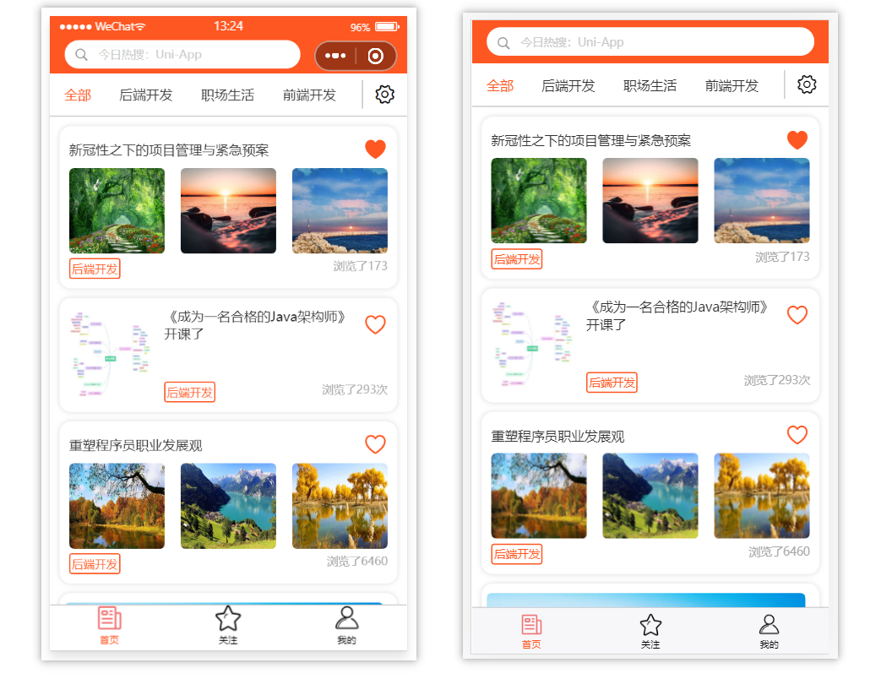
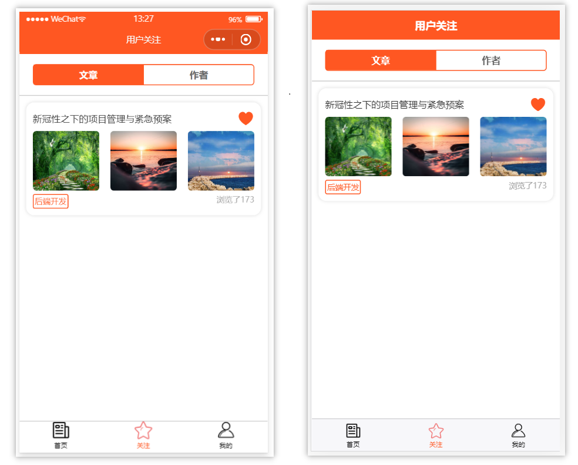
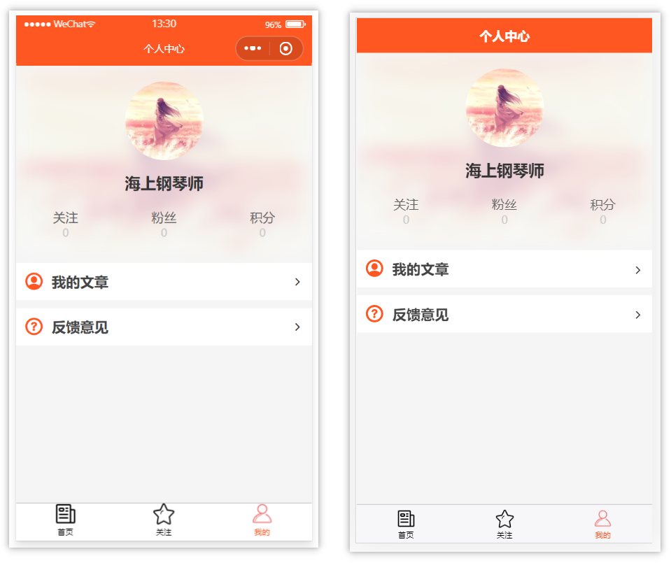
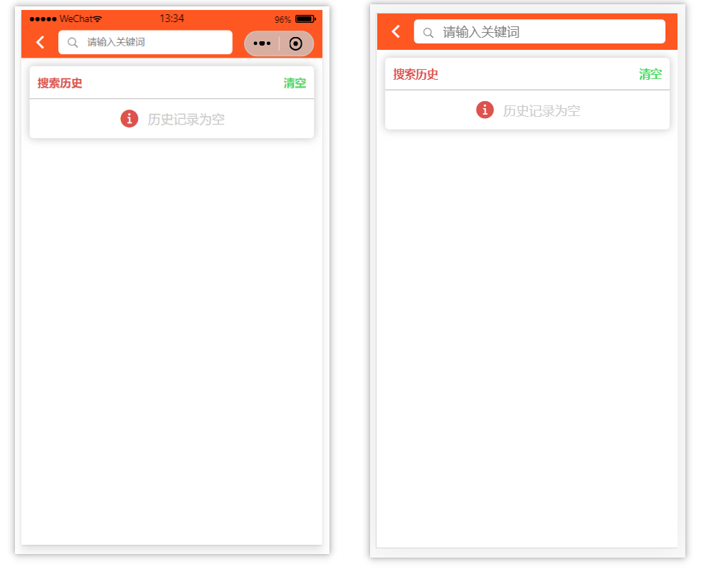
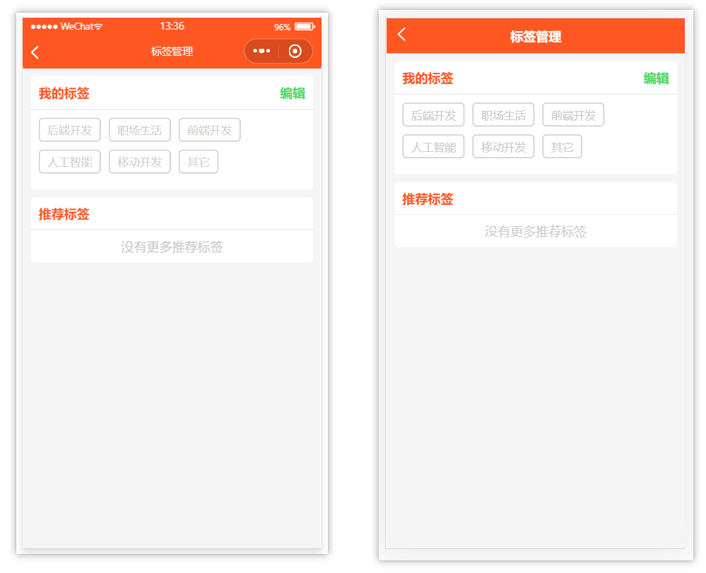
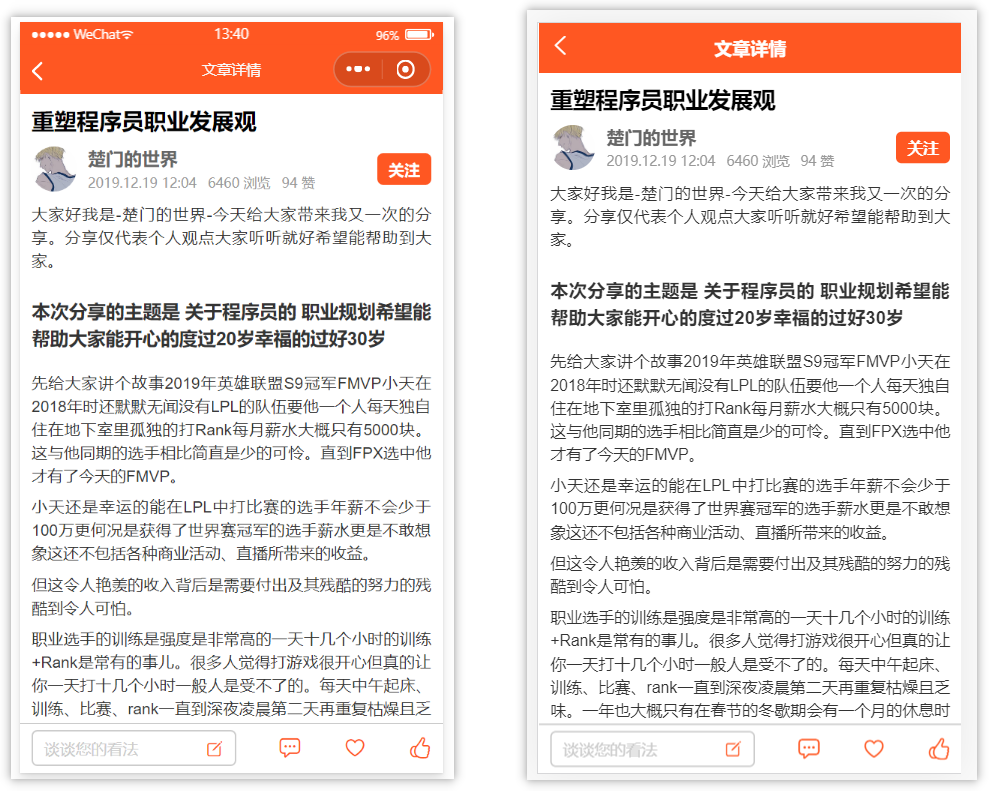
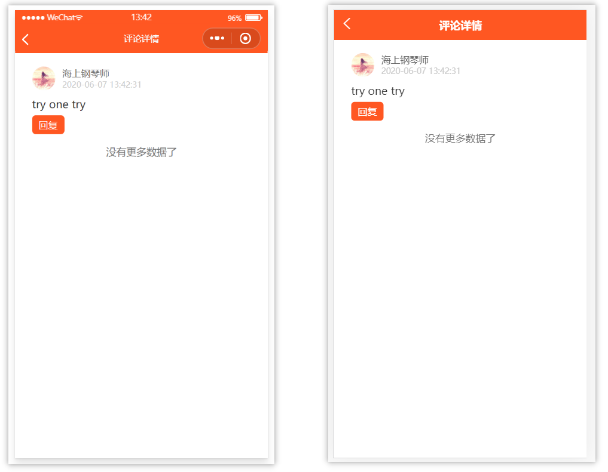
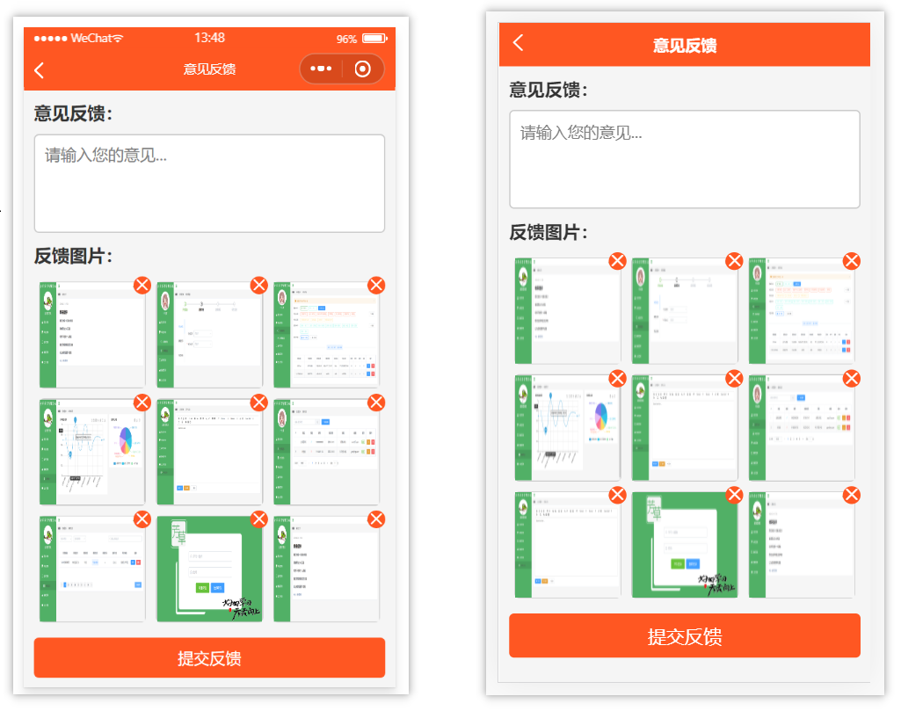
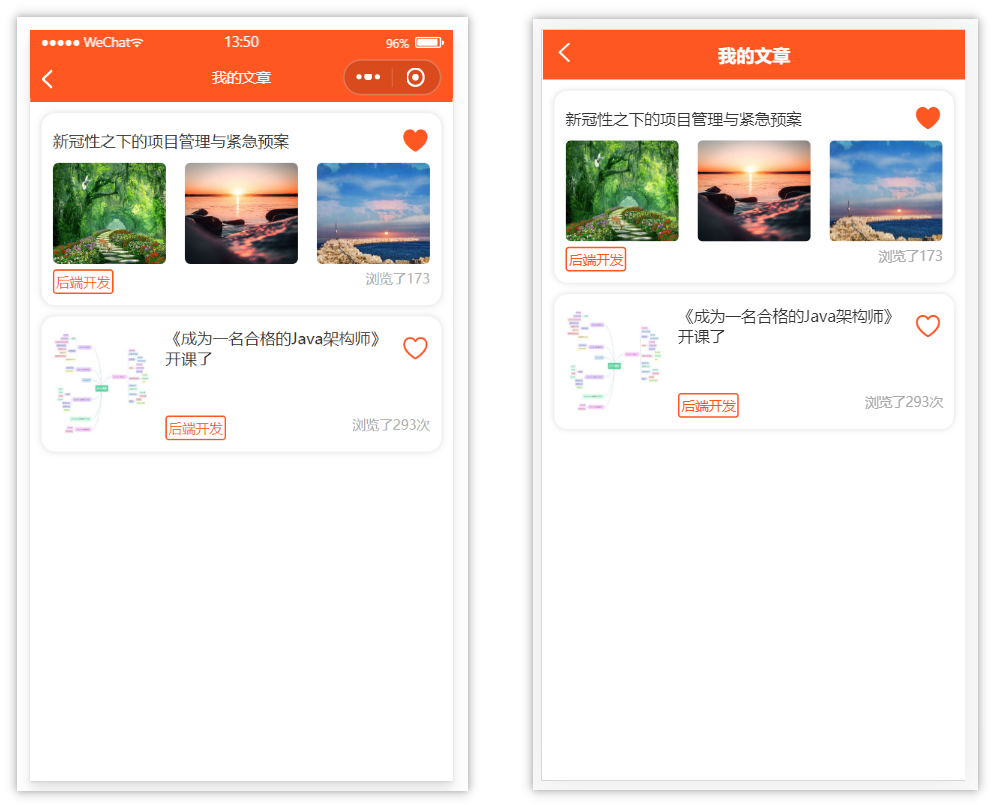

> [TOC]

# 应用简介
- 应用的主打功能是新闻资讯阅读，用户可以进行文章的评论、收餐、点赞，还可以关注喜欢的文章作者
- 应用主要有三个模块，**文章列表模块、关注模块、个人中心模块**
  + 文章列表模块：首屏加载时，会获取文章的列表信息
  + 关注模块：主要分为 `关注文章` 和 `关注作者`，存放用户所有关注过的文章及作者
  + 个人中心模块：展示用户所拥有的`粉丝、积分及关注的作者`，并且还提供了用户所发`文章接口`和`反馈意见接口`

# 实际页面展示
## 应用首页

## 应用关注页

## 应用个人中心页

## 应用搜索页

## 应用标签管理页

## 应用文章详情页

## 应用文章评论页

## 应用反馈意见页

## 应用文章发布历史页

# 总结
- 目前应用主要兼容 `h5` 和 `微信小程序`，`app,ios以及其他平台小程序`还未经测试
- 应用待增功能：`用户登录注册` 和 `文章发表`